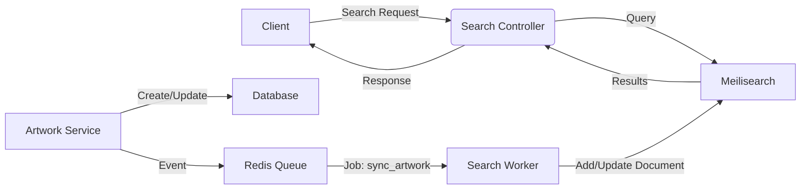

# 🔍 Meilisearch Implementation Plan for LUMINA

Tài liệu này mô tả chi tiết cách triển khai **Search Engine** (Meilisearch) vào dự án Lumina theo kiến trúc Modular Monolith hiện tại.

---

## 1. Kiến trúc tổng quan (Architecture)

Chúng ta sẽ sử dụng chiến lược **Async Syncing** (Đồng bộ bất đồng bộ) thông qua Message Queue để đảm bảo hiệu năng và tính ổn định.



**Tại sao lại là Sync qua Queue?**
*   **Decoupling:** Nếu Meilisearch bị lỗi hoặc đang bảo trì, tính năng chính (Upload/Update Artwork) vẫn hoạt động bình thường.
*   **Performance:** API trả về ngay lập tức, việc index dữ liệu tốn thời gian sẽ chạy ngầm.
*   **Retries:** Queue hỗ trợ tự động thử lại (retry) nếu sync thất bại.

---

## 2. Thiết kế Index (Schema Design)

Chúng ta sẽ tạo một Index tên là `artworks`.

### A. Document Structure
Mỗi document trong Meilisearch sẽ đại diện cho một Artwork với cấu trúc phẳng hóa (flattened) để tối ưu tìm kiếm:

```typescript
interface ArtworkDocument {
  id: string;               // Primary Key (Distinct Attribute)
  title: string;            // Searchable
  description: string;      // Searchable
  slug: string;             // For URL
  
  // Author info (Denormalized)
  author: {
    id: string;
    username: string;
    displayName: string;    // Searchable
    avatar: string;         // Display purpose
  };

  // Image info (Thumbnail only)
  thumbnail: string;
  
  // Tags (Array of strings)
  tags: string[];           // Filterable + Searchable
  
  // Classification
  rating: 'SAFE' | 'R18';   // Filterable
  isAI: boolean;            // Filterable
  
  // Sorting stats
  createdAt: number;        // Sortable (Unix Timestamp)
  likeCount: number;        // Sortable
  viewCount: number;        // Sortable
}
```

### B. Index Settings (Quan trọng)
Cấu hình Luật xếp hạng (Ranking Rules) để đảm bảo kết quả tìm kiếm chất lượng:

| Setting | Value / Attributes | Mục đích |
| :--- | :--- | :--- |
| **Searchable** | `['title', 'tags', 'author.displayName', 'description']` | **Thứ tự quan trọng:** Ưu tiên khớp Tiêu đề trước, rồi đến Tag, Tác giả, cuối cùng mới là Mô tả. |
| **Ranking Rules** | `['words', 'typo', 'proximity', 'attribute', 'sort', 'exactness', 'likeCount:desc', 'viewCount:desc']` | **Tie-breaking:** Nếu 2 ảnh khớp từ khóa như nhau, ảnh nào nhiều Like hơn sẽ được xếp trên. |
| **Filterable** | `['tags', 'rating', 'isAI', 'author.id']` | Hỗ trợ Faceted Search (Lọc nhiều lớp). |
| **Sortable** | `['createdAt', 'likeCount', 'viewCount']` | Sắp xếp kết quả tìm kiếm. |
| **Distinct Attribute** | `id` | Đảm bảo không bao giờ trả về 2 kết quả trùng lặp ID. |
| **Typo Tolerance** | `enabled: true` | Cho phép gõ sai chính tả vẫn ra kết quả. |

---

## 3. Các bước triển khai (Step-by-Step)

### Bước 1: Cài đặt Dependencies
Vào thư mục `backend`:
```bash
pnpm add meilisearch
```

### Bước 2: Tạo Search Module
Tạo module `search` chịu trách nhiệm giao tiếp với Meilisearch.

**File:** `src/modules/search/search.service.ts`
*   Khởi tạo `MeiliSearch` client với host và key từ `.env`.
*   Hàm `onModuleInit`: Tự động kiểm tra và tạo Index + Settings nếu chưa có (Auto-migration).
*   Hàm `search(query, filters)`: Wrapper cho tìm kiếm.
*   Hàm `indexArtwork(artwork)`: Chuyển đổi DB Entity -> Search Document và đẩy lên Meili.
*   Hàm `removeArtwork(id)`: Xóa document.

### Bước 3: Tích hợp vào Queue Worker (Logic Auto-tagging)
Sửa `ArtworkProcessor` (hoặc tạo `SearchProcessor` riêng nếu muốn tách biệt hoàn toàn).

**Quy trình Sync & Merge Tags:**
1.  **Listener:** Lắng nghe sự kiện `artwork.created` hoặc `artwork.updated`.
2.  **Fetch Data:** Query full data từ DB.
3.  **Merge Tags:** Trước khi index, thực hiện gộp tag để tăng khả năng tìm kiếm:
    ```typescript
    // Logic gộp tag
    const finalTags = new Set([
        ...userProvidedTags, // Tag người dùng nhập (ví dụ: "Mèo")
        ...aiDetectedTags    // Tag AI nhận diện (ví dụ: "animal", "pet", "cute")
    ]);
    document.tags = Array.from(finalTags);
    ```
4.  **Index:** Gọi `SearchService.indexArtwork(document)`.

### Bước 4: Tạo API Endpoint (Advanced Search)
**File:** `src/modules/search/search.controller.ts`

**DTO (Advanced Search):**
```typescript
export class SearchArtworkDto {
  @IsString() @IsOptional()
  q?: string;                   // Keyword: "Genshin"

  @IsArray() @IsOptional()
  tags?: string[];              // Filter AND: ["blue", "water"] (Phải có cả 2)

  @IsEnum(['SAFE', 'R18']) @IsOptional()
  rating?: 'SAFE' | 'R18';

  @IsBoolean() @IsOptional()
  excludeAI?: boolean;          // True -> Loại bỏ ảnh AI

  @IsString() @IsOptional()
  sort?: 'newest' | 'popular';  // Map sang "createdAt:desc" hoặc "likeCount:desc"
}
```

**Logic Filter String (Service Layer):**
Meilisearch yêu cầu chuỗi filter logic. Cần helper function để convert DTO thành string:
```typescript
// Input: { tags: ['A', 'B'], excludeAI: true, rating: 'SAFE' }
// Output: "(tags = 'A' AND tags = 'B') AND isAI = false AND rating = 'SAFE'"
```

### Bước 5: Frontend Integration
Sử dụng `instant-meilisearch` hoặc tự build UI với React Query.
*   **Search Bar**: Debounce input (300ms).
*   **Advanced Filter UI**: Checkbox cho Tags, Rating, Exclude AI.

---

## 4. Kế hoạch Verification (Kiểm thử)
1.  **Test Kết nối**: Kiểm tra Dashboard Meilisearch.
2.  **Test Ranking**: Tạo 2 bài viết cùng keyword, like bài 1 nhiều hơn bài 2 -> Search keyword -> Bài 1 phải đứng trên.
3.  **Test Advanced Filter**: Search keyword + tag + excludeAI -> Kết quả phải chính xác.

---

## 5. Script Re-index (Bonus)
Script Admin API (`npm run task:sync-search`) để đồng bộ lại toàn bộ dữ liệu từ DB sang Meilisearch khi cần thiết.

---

## 6. Security & Keys (Bảo mật)
Cần quản lý Key cẩn thận để đảm bảo an toàn dữ liệu.

*   **Master Key (`MEILI_MASTER_KEY`)**:
    *   **Vị trí**: Chỉ dùng ở **Backend** (`.env`).
    *   **Quyền hạn**: Full quyền (Tạo/Xóa Index, Thêm/Sửa/Xóa Document).
    *   **Lưu ý**: Tuyệt đối không expose ra Frontend.

*   **Search Key (Public)**:
    *   **Cách tạo**: Dùng Master Key để generate một key mới chỉ có action `search`.
    *   **Vị trí**: Gửi xuống **Frontend** (hoặc Frontend gọi qua Next.js API Proxy).
    *   **Quyền hạn**: Chỉ được phép tìm kiếm (`search`).
    *   **Mục đích**: Nếu hacker lấy được key này, họ chỉ có thể search dữ liệu public chứ không thể xóa hoặc sửa đổi database của bạn.
